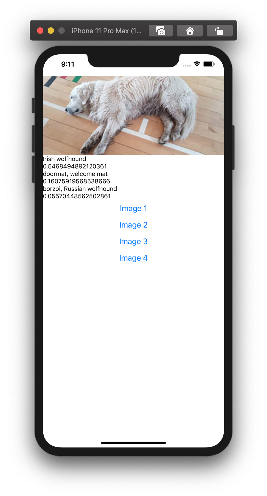

# Tensorflow in React Native
- To get set up with all the right things installed, follow [these](https://www.npmjs.com/package/@tensorflow/tfjs-react-native) instructions. 
- Now read through [this](https://blog.tensorflow.org/2020/02/tensorflowjs-for-react-native-is-here.html?m=1) article to find out what tfjs-react-native can do.
- We decided get the first example from the article running on a phone. It classifies an image using the [Tensorflow Mobilenet model](https://www.tensorflow.org/api_docs/python/tf/keras/applications/MobileNet)

To run this code:
- make sure you have [Expo installed](https://expo.io/learn)
- Check out the code from this repository.
- In your terminal, `cd` to the project directory. 
- Run the command `npm install` 
- Run the command `expo r -c`
- The expo tools should launch from where you can run the example in a simulator or on a phone.
- It may take a while to respond at first while it loads the model and images.
- The app performs better with the Expo client on an actual phone, it is much slower on a simulator.

The code can be updated to add new images of your own. We discovered that keeping the images quite small, with a maximum of 300 pixels, made the app more responsive and efficient. 

